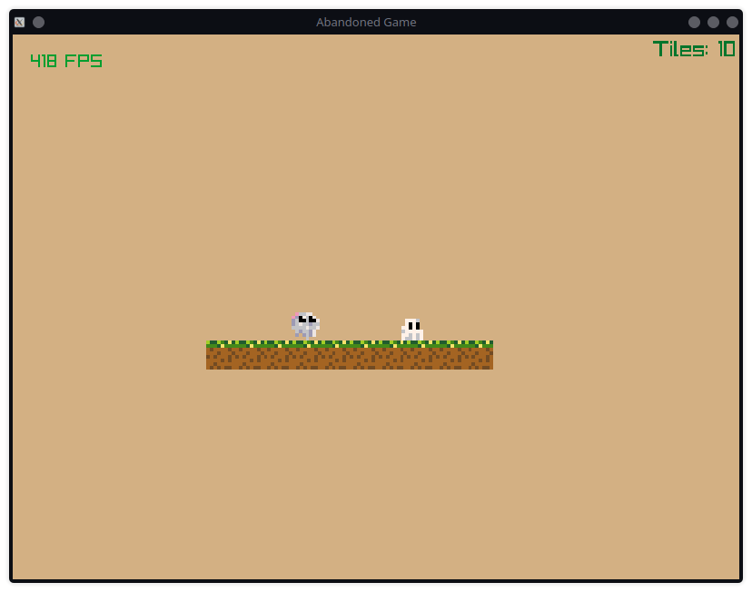

# Abandoned Game

this is my 2d pixel platformer, and I will probably abandon it (lol)



## Quickstart

```shell
$ odin run .
```
for debug purposes (additional memory tracking):

```shell
$ odin run . -debug
```
## TODO

- [x] basic health (hp) mechanics
    - game resets when player health <= 0
- [ ] entity should be knocked back on damage
- [ ] main menu ?
- [ ] add game over screen
